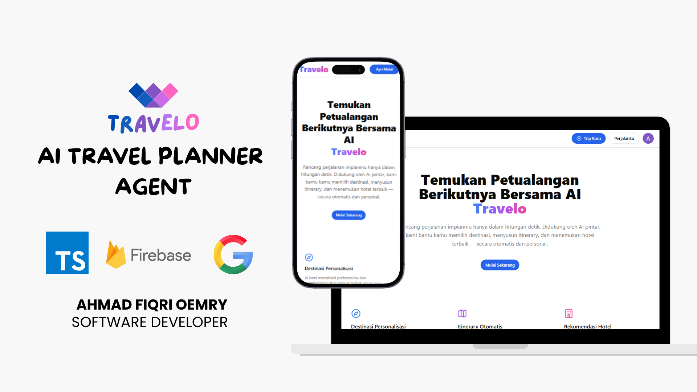
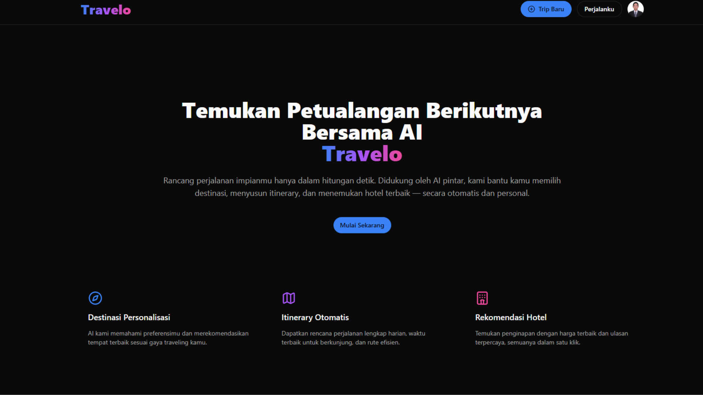
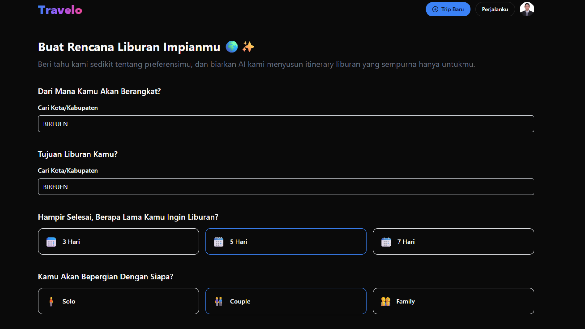
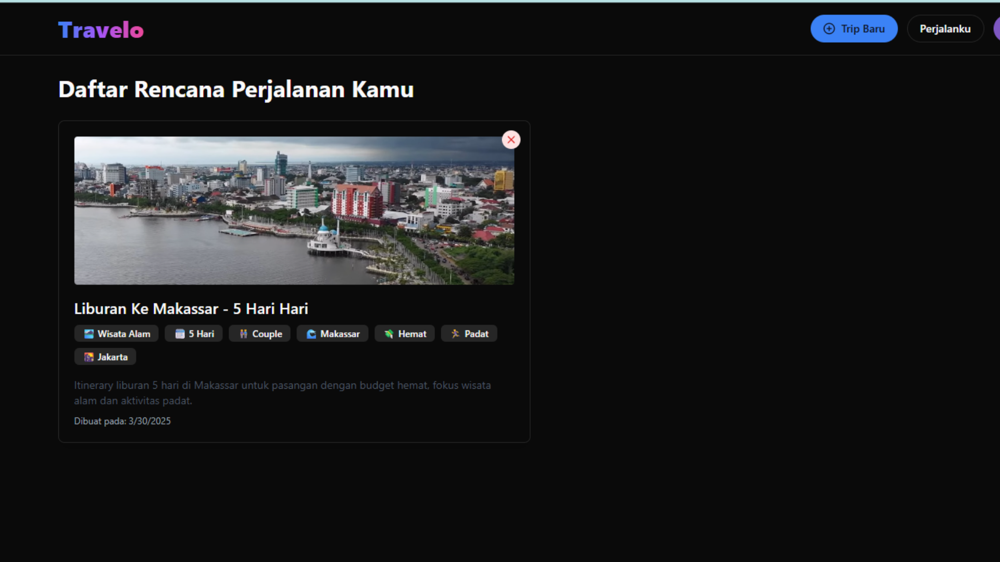
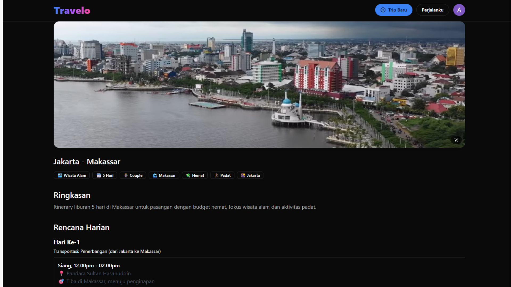

# 🛍️ Travelo – AI Trip Planner Web App

Travelo is an AI-powered travel planning application that helps users create fully customized and intelligent travel itineraries in just seconds. Users can define their preferences—such as departure location, destination, duration, and budget—and Travelo will instantly generate a complete day-by-day plan including activities, transportation, hotel suggestions, and local travel tips.

Built using Gemini AI, Firebase, and the modern React ecosystem, Travelo simplifies the trip planning experience and turns it into an interactive, efficient, and enjoyable process.

## 1. Project Overview

The goal of Travelo is to eliminate the hassle and complexity of manually planning trips. Whether you're a solo traveler or a family on vacation, finding activities, coordinating hotel stays, and organizing schedules can be overwhelming and time-consuming.

Travelo addresses this by offering an intelligent, AI-assisted planning tool that generates personalized itineraries in real-time. The app captures user inputs through a guided step-by-step interface, processes them using Gemini AI, and presents structured travel recommendations instantly—empowering users with both flexibility and automation.

## 2. Project Requirements

- Build a user-friendly interface for creating and managing AI-generated travel itineraries

- Integrate AI (Gemini) to generate smart and relevant travel plans

- Authenticate users using Google Sign-In (Firebase Auth)

- Store user trips in a secure and scalable database (Firebase Firestore)

- Support city search and geolocation with external APIs (Geoapify)

- Provide smooth UX including dark mode, step-by-step flow, and responsive design

- Allow users to save, view, and delete trip plans easily

## 3. The Challenge

Creating an AI-driven travel planner involved balancing personalization and speed. The biggest challenge was ensuring accurate and engaging travel recommendations using user input, all within a few seconds. Furthermore, handling various integration points—AI prompt handling, API throttling, user session management, and real-time Firestore syncing—required a seamless data flow and robust architecture.

Another key concern was managing user expectations with AI output, and designing a UI that guides without overwhelming.

## 4. The Approach & Solution

To address these challenges, Travelo was built as a modular React app with TypeScript and Zustand for clean state management. A multi-step form captures trip preferences, which are passed to Gemini AI via a curated and structured prompt. The output is parsed into an interactive itinerary with hotel and activity suggestions.

User authentication and trip persistence are managed through Firebase Auth and Firestore, while Geoapify is used for flexible city lookup and location data. The interface uses Framer Motion for animations, TailwindCSS for responsive design, and Headless UI for accessible components.

Each trip is saved under the user’s account and can be deleted or revisited from the “My Trips” dashboard. Dark mode toggle and mobile optimization ensure the app is pleasant to use in any environment.

## 5. Key Features

- 🔐 Google login (Firebase Auth)
- 📍 Departure & destination city selection
- 🧠 AI-generated itinerary
- 🏨 Hotel & daily activity recommendations
- 🔖 Save and view detailed trip plans
- 🌙 Light/Dark mode toggle
- 🗑️ Delete trip plans with confirmation
- 📱 Responsive and user-friendly interface

## 6. Tech Stack

### 6.1 Frontend

- React with Typescript
- React Router
- Zustand (State Management)
- Framer Motion (Animations)
- TailwindCSS (Styling)
- ShadCN UI / Headless UI (for Dialog components)

### 6.2 Backend / Services

- Firebase Firestore
- Firebase Auth (Google Login)
- Gemini API (Google)
- Geoapify API (for location)

## 7. Folder Structure

```
├── src/
│   ├── api/               # Koneksi API: Firebase, Gemini, Geoapify
│   ├── components/        # Reusable UI components (Button, Dialog, Badge, dsb)
│   ├── hooks/             # Custom React hooks (theme, scrollToTop)
│   ├── pages/             # Halaman utama (Home, CreateTrip, SavedTrip, DetailTrip)
│   ├── store/             # Zustand store (useTripStore, useAuthStore)
│   ├── config/            # State, constant, emojiMap, prompt templates
│   ├── App.tsx            # Root routing dengan React Router
│   └── main.tsx           # Entry point React
```

## 8. Installation and Setup

Follow these steps to run the project locally:

1. Clone the repository:

```
git clone https://github.com/fiqrioemry/ai_travel_planner_web_app.git
cd ai_travel_planner_web_app
```

2. Install dependencies:

```
npm install
```

3. Start the development server:

```
npm rum
```

App will be running on http://localhost:5173

## 9. How to Use

1. **Login**

   - Click the “Get Started” button on the homepage and log in with Google.

2. **Create a Trip**

   - Go to `/create-trip`, fill out all trip preferences via a step-by-step UI, and click "Generate Trip".

3. **Save & View Trip Details**

   - Successfully generated trips will be stored in Firebase and can be revisited at `/my-trips`. Click on a card to view full details.

4. **Delete a Trip**
   - Click the 🖑 icon at the top-right of a trip card. A confirmation dialog will appear before deletion.

## 🔐 Environment Configuration (.env)

```
VITE_FIREBASE_API_KEY=your_api_key
VITE_FIREBASE_AUTH_DOMAIN=your_project.firebaseapp.com
VITE_FIREBASE_PROJECT_ID=your_project_id
VITE_FIREBASE_STORAGE_BUCKET=your_project.appspot.com
VITE_FIREBASE_MESSAGING_SENDER_ID=your_messaging_id
VITE_FIREBASE_APP_ID=your_app_id
VITE_GEMINI_API_KEY=your_gemini_key
VITE_GEOAPIFY_KEY=your_geoapify_key
```

## 9. Deployment

This project is hosted using a web hosting provider, but you can also deploy it to SaaS platforms such as **Vercel** or **Netlify**:

- Connect your Git repository
- Add environment variables in the dashboard
- Set build command:

```
  npm run build
```

- Output directory: `dist`

## 🤝 Contribution

Open for contributions to improve features:

- Fork the repository
- Create a new branch: `git checkout -b your-feature`
- Commit changes: `git commit -m 'feat: your feature'`
- Push your branch: `git push origin your-feature`
- Open a Pull Request

## 🪪 License

**MIT License**

## 👤 Developer - Author

- Name: Ahmad Fiqri Oemry
- 📧 Email: ahmadfiqrioemry@gmail.com
- 🌐 LinkedIn: [linkedin.com/in/ahmadfiqrioemry](https://www.linkedin.com/in/ahmadfiqrioemry)
- 🌐 Live preview : https://aitravelplanner.ahmadfiqrioemry.com

## 🖼️ Preview

Below are some previews of the AI travel planner web pages:

**Homepage**  
**Create Trip**  
**Trip Details**  
**My Trip List**

  
  
  

